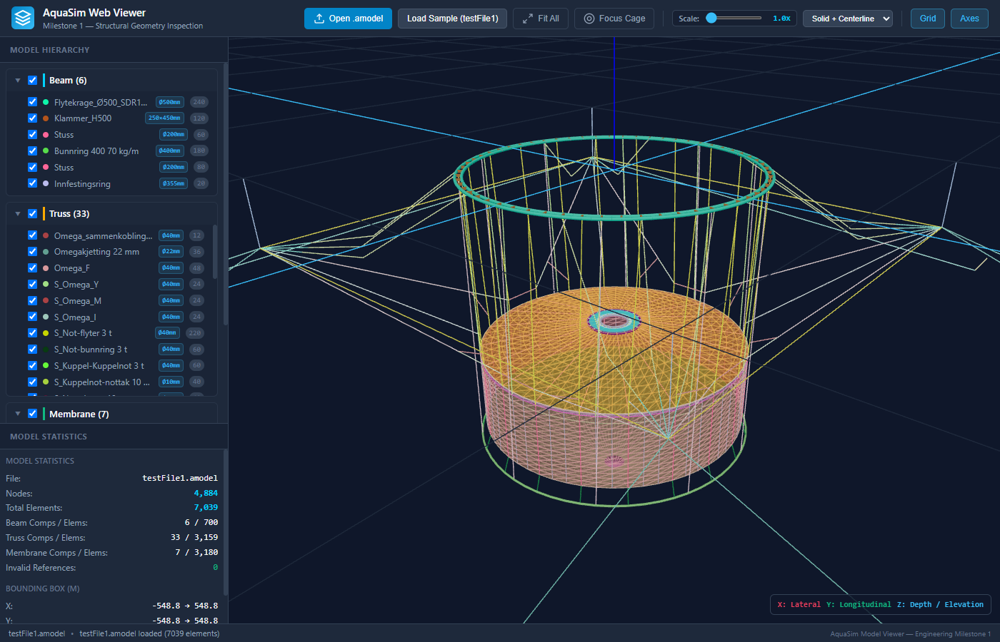

# Amodel Viewer

A browser-based 3D viewer for AquaSim `.amodel` files, built with TypeScript,
Three.js, and Vite. Parsing and rendering run locally in the browser; model
files are never uploaded. The viewer starts empty and accepts local files.

[Open the viewer](https://hui-aqua.github.io/AmodelViewer/) |
[User guide](docs/user-guide.md) | [MIT license](LICENSE)

## Development

Use Node.js 24 (see `.nvmrc`), then:

```sh
npm ci
npm run dev
```

Open the URL printed by Vite. Choose **Open .amodel** or drop an `.amodel`
or XML model onto the viewport. The UI supports component visibility,
model statistics, camera alignment and projection, section display modes,
grid and axes, light/dark themes, and a collapsible sidebar.
`?focus=cage` frames the cage after loading a model.

## Commands

| Command | Purpose |
| --- | --- |
| `npm run dev` | Start the development server |
| `npm test` | Run parser, file loading, tree, geometry, and viewer tests |
| `npm run typecheck` | Check application and test TypeScript |
| `npm run build` | Type-check and create the production site in `dist/` |
| `npm run preview` | Serve the production build locally |
| `npm run check` | Run type checks, tests, and the production build |

## Structure

```text
src/
  main.ts                   Browser entry point
  app/initializeApp.ts      Model loading and UI orchestration
  parser/                   XML parsing, validation, and model types
  viewer/
    AquaSimViewer.ts         Scene, cameras, controls, and resource lifecycle
    cameraUtils.ts          Coordinate conversion and camera framing
    renderers/              Shared line rendering, beams, trusses, membranes
  ui/                       File loading, model tree, theme and sidebar
  styles/main.css           Application styles
tests/
  *.test.ts                 Behavior and regression tests
  fixtures/                 Model data used only by tests
public/branding/            Runtime branding assets
docs/                       User guide and screenshots
.github/workflows/          Pages deployment and release packaging
```

The parser depends on browser XML APIs and has no Three.js dependency.
Renderers consume normalized parser types. The viewer owns rendering
resources; the application connects it to the UI. Tests use Vitest with
happy-dom and include a real model fixture without shipping it to users.

## Build and deployment

Production output is generated only in `dist/` and is ignored by Git.
GitHub Pages deploys that directory through `.github/workflows/deploy.yml`.
Configure the repository's Pages source as **GitHub Actions**.
`.github/workflows/release.yml` packages the same output into
`aquasim-web-viewer-standalone.zip` when a release is published.

For offline use, unpack the release and serve its directory with a local HTTP
server (for example, `python -m http.server`). ES modules require HTTP;
opening `index.html` directly with a `file://` URL is unsupported.
The relative asset base also supports hosting under a subdirectory.
Screenshots and test fixtures are excluded from the deployed bundle.

## Screenshots

| Cage | Mooring array |
| --- | --- |
|  |  |

## Notices

AquaSim is a trademark of Aquastructure AS. This independent viewer is not
affiliated with or endorsed by Aquastructure AS. See
[third-party notices](THIRD_PARTY_NOTICES.md) for license and data notices.
