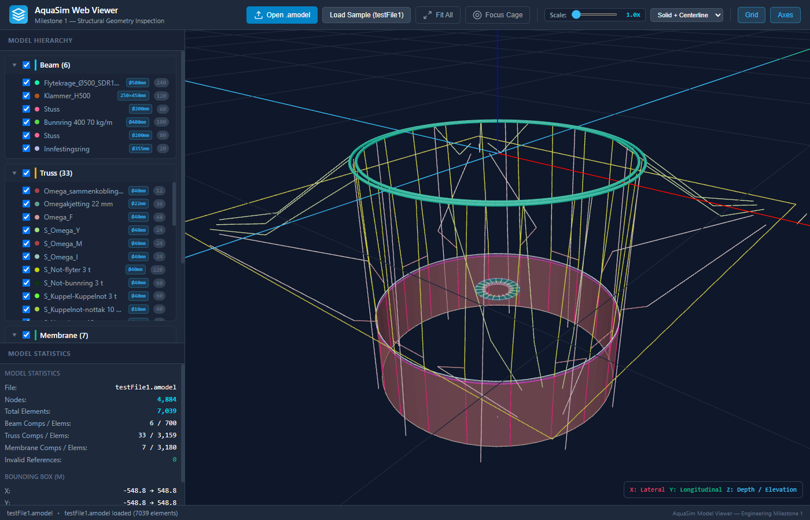
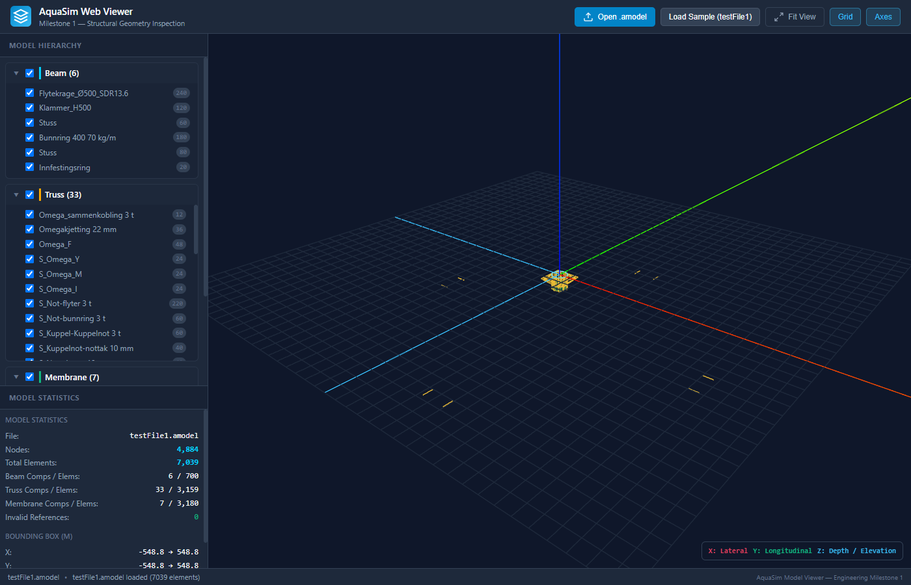

# Amodel Viewer -- A Web-based Viewer for AquaSim Model Files

[](LICENSE)
[](https://hui-aqua.github.io/AmodelViewer/)
[](https://www.typescriptlang.org/)
[](https://threejs.org/)
[](https://vitejs.dev/)

A modern, lightweight 3D engineering viewer designed to open, inspect, and analyze **AquaSim** `.amodel` marine aquaculture simulation files directly in any web browser.

No software installation, license dongles, or server setups required.

---

## 🚀 Ways to Use This Tool

Choose the method that best fits your needs:

### 🌟 Method 1: Instant Web App (Recommended — Zero Installation)
You can use the viewer immediately without installing any software or programming tools:

1. Open the live online viewer in your web browser:  
   👉 **[https://hui-aqua.github.io/AmodelViewer/](https://hui-aqua.github.io/AmodelViewer/)**
2. Drag and drop your `.amodel` file directly into the browser window, or click **"Open .amodel"**.
3. Your 3D structural model will be rendered instantly!

> **🔒 100% Client-Side Privacy Guarantee:**  
> Your `.amodel` files **never leave your computer**. All parsing and 3D rendering are executed entirely inside your browser's local memory. No files or engineering data are uploaded to any external server or cloud.

---

### 📦 Method 2: Offline Standalone Application (No Internet Required)
If you work offline or in secure environments where internet access is restricted:

1. Go to the [Releases](https://github.com/hui-aqua/AmodelViewer/releases) page.
2. Download `aquasim-web-viewer-standalone.zip`.
3. Unzip the archive to any folder on your computer.
4. Launch the local web server or open `index.html` (e.g., using VS Code Live Server or python `python -m http.server`).

---

### 💻 Method 3: Developer Setup (From Source Code)
If you want to modify the code or contribute to the project:

1. Ensure [Node.js](https://nodejs.org/) (v18 or higher) is installed.
2. Clone the repository and enter the directory:
   ```bash
   git clone https://github.com/hui-aqua/AmodelViewer.git
   cd AmodelViewer
   ```
3. Install dependencies and start the local development server:
   ```bash
   npm install
   npm run dev
   ```
4. Open `http://127.0.0.1:5173/` in your browser.

---

## 📸 Screenshots

| Floating Collar & Underwater Net Cone | Complete 1.1 km Mooring Array |
|:---:|:---:|
|  |  |

---

## 📖 User Guide (For Ordinary Users)

### Step 1: Open or Select an AquaSim Model
- **Drag & Drop:** Simply drag any `.amodel` file from your desktop or file manager and drop it anywhere onto the 3D viewport.
- **Open File Button:** Click the blue **"Open .amodel"** button in the top toolbar to browse your local drives.
- **Sample Benchmark Models:** Don't have a model file at hand? Use the built-in sample dropdown menu in the top toolbar to explore 4 real pre-loaded aquaculture models:
  - `testFile1.amodel`: Full marine fish farm cage with underwater net cone and 1.1 km catenary mooring lines.
  - `winch_cage.amodel`: Winch-lowered cage assembly with suspension bridles.
  - `ENC172233860Winch_nearSurface.amodel`: Subsurface winch cage configuration.
  - `ENCC100323640.amodel`: Heavy-duty circular cage model.

---

### Step 2: 3D Camera Controls
Navigate around your model using intuitive mouse, trackpad, or touch gestures:

| Action | Mouse | Touch Screen (Tablet / Phone) |
|---|---|---|
| **Rotate View (Orbit)** | **Left-click + Drag** | One-finger swipe |
| **Pan / Move View** | **Right-click + Drag** (or **Middle-click + Drag**) | Two-finger drag |
| **Zoom In / Out** | **Scroll Wheel** | Pinch with two fingers |

---

### Step 3: Top Toolbar Features

| Button / Control | Description | When to Use |
|---|---|---|
| **Fit All** | Frames the camera to show the **entire model** bounding box. | Use when you want an overview of the whole marine array, including seabed anchor lines over 1 km away. |
| **Focus Cage** | Zooms camera directly in on the **floating collar and net cage**. | Use when inspecting the central cage structure (~50 m diameter) without getting lost in distant mooring lines. |
| **Scale Slider** (`0.5x` - `20x`) | Dynamically adjusts the **3D thickness of cables, ropes, and pipes**. | Fine mooring lines and cables can be hard to see when zoomed out. Increase the slider to make thin ropes clearly visible! |
| **Display Mode** | Switch between **Solid + Centerline**, **Solid 3D Only**, or **Centerline Only**. | Choose *Solid 3D* for realistic cross-sections, or *Centerline* for pure wireframe structural analysis. |
| **Grid** | Toggles the sea-surface reference grid on/off. | Positioned at water level ($Z = 0$) to easily differentiate surface structures from submerged components. |
| **Axes** | Toggles 3D coordinate orientation indicators. | Red = lateral (X), Green = longitudinal (Y), Blue = vertical depth (Z). |

---

### Step 4: Model Hierarchy & Component Toggles
The left sidebar displays an interactive hierarchy of all structural components extracted from the `.amodel` file:

- **Structural Categories:**
  - 🔵 **Beam Elements:** Rigid collars, floating rings, brackets, and pipe frames (displays cross-section dimensions, e.g., `Ø500mm` or `250×500mm`).
  - 🟠 **Truss Elements:** Mooring catenary lines, anchor chains, bridle ropes, and winch cables (displays diameter, e.g., `Ø30mm`).
  - 🟢 **Membrane Elements:** Triangulated aquaculture net panels, net bottoms, dome netting, and roofs.
- **Show / Hide Checkboxes:**
  - Uncheck the category checkbox to hide an entire group (e.g., hide all nets to clearly see the internal ropes and bottom weight rings).
  - Uncheck individual components to inspect specific rigging lines or structural segments.
- **Authentic Colors:** Color swatches accurately reflect the RGB colors defined in the AquaSim model XML.

---

### Step 5: Model Statistics Panel
Located at the bottom of the left sidebar, providing instant numerical verification:
- **Node Count:** Total number of 3D node coordinates.
- **Element Count:** Detailed breakdown across Beams, Trusses, and Membranes.
- **Dimensions (Bounding Box):** Span of the structure in meters along X, Y, and Z ($Z = 0$ is the water surface; negative $Z$ values represent water depth toward the seabed).
- **Integrity Validation:** Flags missing node references or connectivity anomalies.

---

## 📊 Benchmark Model (`testFile1.amodel`)

| Metric | Measured Value |
|---|---|
| **Nodes** | 4,884 |
| **Total Elements** | 7,039 |
| **Beam Components / Elements** | 6 components / 700 elements |
| **Truss Components / Elements** | 33 components / 3,159 elements |
| **Membrane Components / Elements** | 7 components / 3,180 elements |
| **Invalid References** | 0 |
| **Bounding Box X** | $-548.787\,\text{m} \rightarrow +548.787\,\text{m}$ (1,097.57 m span) |
| **Bounding Box Y** | $-548.787\,\text{m} \rightarrow +548.787\,\text{m}$ (1,097.57 m span) |
| **Bounding Box Z** | $-190.824\,\text{m} \rightarrow 0.000\,\text{m}$ (190.82 m water depth) |

---

## 📁 Modern Project Architecture

```text
AmodelViewer/
├── .github/
│   └── workflows/
│       ├── deploy.yml          # Automated CI/CD deployment to GitHub Pages
│       └── release.yml         # Automated GitHub Release standalone zip bundler
├── public/                     # Static assets served directly
│   ├── models/                 # Sanitized benchmark .amodel simulation models
│   │   ├── testFile1.amodel
│   │   ├── winch_cage.amodel
│   │   ├── ENC172233860Winch_nearSurface.amodel
│   │   └── ENCC100323640.amodel
│   ├── aquasim_cage_preview.png
│   └── aquasim_viewer_preview.png
├── src/                        # Modular application source code (@/*)
│   ├── parser/                 # Pure TypeScript XML parsing & validation (No Three.js)
│   │   ├── amodelParser.ts     # Browser DOMParser, node extraction, section inference
│   │   └── types.ts            # Normalized data models and interfaces
│   ├── viewer/                 # Three.js 3D rendering layer
│   │   ├── AquaSimViewer.ts    # Main viewer engine (scene, camera, lights, controls)
│   │   ├── beamRenderer.ts     # 3D solid InstancedMesh & centerline renderer
│   │   ├── trussRenderer.ts    # 3D circular InstancedMesh & centerline renderer
│   │   ├── membraneRenderer.ts # Triangulated mesh & twine wireframe renderer
│   │   └── cameraUtils.ts      # Coordinate transforms & camera framing
│   ├── ui/                     # User interface components
│   │   ├── fileLoader.ts       # Drag-and-drop & file selection handlers
│   │   └── modelTree.ts        # Hierarchy tree, visibility toggles & stats panel
│   ├── main.ts                 # Application bootstrapping & event orchestration
│   └── style.css               # Engineering dark theme CSS tokens
├── tests/                      # Automated Vitest test suite
│   ├── amodelParser.test.ts    # Model parser and XML extraction tests (10 tests)
│   └── renderers.test.ts       # 3D geometry and rendering tests (4 tests)
├── index.html                  # HTML entry point with semantic layout
├── package.json                # Project dependencies, scripts and metadata
├── tsconfig.json               # Strict TypeScript config with @/* path aliases
├── vite.config.ts              # Vite 8 config with relative base & vendor chunking
├── LICENSE                     # MIT Open Source License
├── THIRD_PARTY_NOTICES.md      # IP clearance, trademark & third-party notices
└── .gitignore                  # Git ignore rules for builds, dependencies and IDEs
```

---

## 🧪 Testing & Production Build

### Run Unit Tests
```bash
npm test
```
Runs 14 automated Vitest tests covering:
- Node coordinate extraction with non-sequential IDs
- Beam, Truss, and Membrane element connectivity
- Component `<color>` attribute extraction
- Broken node reference tolerance and warnings
- Complete parsing of all 4 real `.amodel` benchmark models
- 3D solid cross-sections and dynamic scaling
- Membrane quad triangulation and translucent depth ordering

### Type Check
```bash
npm run typecheck
```
Executes strict TypeScript compiler checks without emitting code.

### Build Production Bundle
```bash
npm run build
```
Generates an optimized, minified static distribution in `dist/` with vendor chunk splitting:
- `assets/three-[hash].js`: Three.js 3D engine chunk (~504 kB)
- `assets/index-[hash].js`: Application bundle (~25 kB)
- `assets/index-[hash].css`: Stylesheet (~7.8 kB)

---

## ⚖️ Intellectual Property Clearance & Disclaimers

### Trademark Notice
**AquaSim®** is a registered trademark of **Aquastructure AS** (Trondheim, Norway).  
**Amodel Viewer** is an independent, community-developed, open-source 3D visualization tool. It is **not** affiliated with, authorized by, sponsored by, or connected with Aquastructure AS. References to AquaSim and the `.amodel` format are used solely in a descriptive, nominative fair-use capacity to indicate file format compatibility.

### Data Sanitization
All benchmark simulation models included in `public/models/` have been cleansed of proprietary company names, confidential drive paths, customer references, and personal author identifiers.

For full license texts and third-party notices, please refer to [THIRD_PARTY_NOTICES.md](THIRD_PARTY_NOTICES.md).

---

## 📄 License

This project is licensed under the [MIT License](LICENSE).
